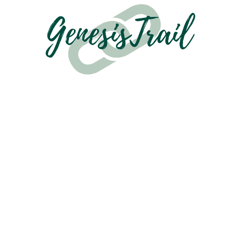

# Genesis Trail

A distributed Hyperledger Fabric full-stack application for Organic Food Traceability. 

Project presentation and Demo: https://drive.google.com/file/d/1wkrK7ussvgkr94J24ZCKkZ6tvcg27Nnt/view \
Project Report: https://github.com/dhruvapanyam/CS2361-project/blob/main/Genesis%20Trail%20Final%20Report.pdf

If you are running the hyperledger fabric for the first time, ensure that you have curl, docker and node installed. To run this app, you will also need python and flask. 

Steps to run the app:
1. Download the fabric samples and binaries here:'curl -sSL http://bit.ly/2ysbOFE | bash -s -- 1.4.6 1.4.6 0.4.18'.
2. (The fabric samples folder downloaded above is what we have called hyperledger in our repository).
3. Copy the genesistrail folder from hyperledger into your fabric samples folder.
4. Go into the chaincode folder in hyperledger and copy the 'genesistrail' folder into the chaincode folder of fabric samples that you downloaded. 
5. Go to fabric-samples/genesistrail/javascript and run the 'npm install' command. 
6. Return to the fabric-samples/genesistrail folder, ensure your docker containers are running and run the './startGensisTrail.sh' script.
7. The above will set up the blockchain network. 
8. Navigate to the front end application - genesis_trail_flask/app.py and change the PATH_DIR to point it to the javascript folder within fabric samples in your machine. 
9. Run the flask app as follows (make sure that you are in the genesis_trail_flask folder: 
'''
$ export FLASK_APP=app.py
$ flask run
'''
10. The website should pop up in your browser: You can log in, register yourself, add and validate transactions or simply view the lifecycle of a product.

#### The contributors of this project are Dhruva Panyam and Rathi Kashi. 
